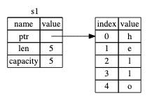
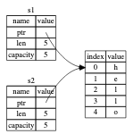
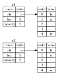
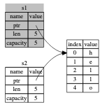
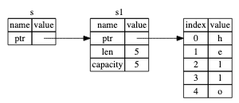

# Ownership

## 所有权

**所有权**（ownership）是 Rust 用于如何管理内存的一组规则。所有程序都必须管理其运行时使用计算机内存的方式。一些语言中具有垃圾回收机制，在程序运行时有规律地寻找不再使用的内存；在另一些语言中，程序员必须亲自分配和释放内存。Rust 则选择了第三种方式：通过所有权系统管理内存，编译器在编译时会根据一系列的规则进行检查。如果违反了任何这些规则，程序都不能编译。在运行时，所有权系统的任何功能都不会减慢程序。

> **栈（Stack）与堆（Heap）**
> 在很多语言中，你并不需要经常考虑到栈与堆。不过在像 Rust 这样的系统编程语言中，值是位于栈上还是堆上在更大程度上影响了语言的行为以及为何必须做出这样的抉择。
>
> 栈和堆都是代码在运行时可供使用的内存，但是它们的结构不同。栈以放入值的顺序存储值并以相反顺序取出值。这也被称作 后进先出（last in, first out）。想象一下一叠盘子：当增加更多盘子时，把它们放在盘子堆的顶部，当需要盘子时，也从顶部拿走。不能从中间也不能从底部增加或拿走盘子！增加数据叫做 进栈（pushing onto the stack），而移出数据叫做 出栈（popping off the stack）。栈中的所有数据都必须占用已知且固定的大小。在编译时大小未知或大小可能变化的数据，要改为存储在堆上。 堆是缺乏组织的：当向堆放入数据时，你要请求一定大小的空间。内存分配器（memory allocator）在堆的某处找到一块足够大的空位，把它标记为已使用，并返回一个表示该位置地址的 指针（pointer）。这个过程称作 在堆上分配内存（allocating on the heap），有时简称为 “分配”（allocating）。（将数据推入栈中并不被认为是分配）。因为指向放入堆中数据的指针是已知的并且大小是固定的，你可以将该指针存储在栈上，不过当需要实际数据时，必须访问指针。想象一下去餐馆就座吃饭。当进入时，你说明有几个人，餐馆员工会找到一个够大的空桌子并领你们过去。如果有人来迟了，他们也可以通过询问来找到你们坐在哪。
>
> 入栈比在堆上分配内存要快，因为（入栈时）分配器无需为存储新数据去搜索内存空间；其位置总是在栈顶。相比之下，在堆上分配内存则需要更多的工作，这是因为分配器必须首先找到一块足够存放数据的内存空间，并接着做一些记录为下一次分配做准备。
>
> 访问堆上的数据比访问栈上的数据慢，因为必须通过指针来访问。现代处理器在内存中跳转越少就越快（缓存）。继续类比，假设有一个服务员在餐厅里处理多个桌子的点菜。在一个桌子报完所有菜后再移动到下一个桌子是最有效率的。从桌子 A 听一个菜，接着桌子 B 听一个菜，然后再桌子 A，然后再桌子 B 这样的流程会更加缓慢。出于同样原因，处理器在处理的数据彼此较近的时候（比如在栈上）比较远的时候（比如可能在堆上）能更好的工作。
>
> 当你的代码调用一个函数时，传递给函数的值（包括可能指向堆上数据的指针）和函数的局部变量被压入栈中。当函数结束时，这些值被移出栈。
>
> 跟踪哪部分代码正在使用堆上的哪些数据，最大限度的减少堆上的重复数据的数量，以及清理堆上不再使用的数据确保不会耗尽空间，这些问题正是所有权系统要处理的。一旦理解了所有权，你就不需要经常考虑栈和堆了，不过明白了所有权的主要目的就是管理堆数据，能够帮助解释为什么所有权要以这种方式工作。

**所有权规则**
首先，让我们看一下所有权的规则:

> Rust 中的每一个值都有一个 **所有者**（owner）。
> 值在任一时刻有且只有一个所有者。
> 当所有者（变量）离开作用域，这个值将被丢弃。

## 变量作用域

变量的 **作用域**（scope），作用域是一个项（item）在程序中有效的范围。

有这样一个变量：
```rust
let s = "hello";
```

变量 `s` 绑定到了一个字符串字面值，这个字符串值是硬编码进程序代码中的。这个变量从声明的点开始直到当前 **作用域** 结束时都是有效的。

```rust
{                      // s 在这里无效，它尚未声明
    let s = "hello";   // 从此处起，s 是有效的

    // 使用 s
}                      // 此作用域已结束，s 不再有效
```

换句话说，这里有两个重要的时间点：
- 当 s **进入作用域** 时，它就是有效的。
- 这一直持续到它 **离开作用域** 为止。

## String 类型

前面介绍的类型都是已知大小的，可以存储在栈中，并且当离开作用域时被移出栈，如果代码的另一部分需要在不同的作用域中使用相同的值，可以快速简单地复制它们来创建一个新的独立实例。不过我们需要寻找一个存储在堆上的数据来探索 Rust 是如何知道该在何时清理数据的。

我们已经见过字符串字面值（""双引号包裹的字符串），即被硬编码进程序里的字符串值。字符串字面值是很方便的，不过它们并不适合使用文本的每一种场景。原因之一就是它们是不可变的。另一个原因是并非所有字符串的值都能在编写代码时就知道：例如，要是想获取用户输入并存储该怎么办呢？为此，Rust 有另一种字符串类型，`String`。这个类型管理被分配到堆上的数据，所以能够存储在编译时未知大小的文本。可以使用 from 函数基于字符串字面值来创建 String，如下：

```rust
let s = String::from("hello");
```

这两个冒号 `::` 是运算符，允许将特定的 `from` 函数置于 `String` 类型的命名空间（`namespace`）下，而不需要使用类似 string_from 这样的名字。

可以 修改此类字符串：

```rust
let mut s = String::from("hello");

s.push_str(", world!"); // push_str() 在字符串后追加字面值

println!("{}", s); // 将打印 `hello, world!`
```

那么这里有什么区别呢？为什么 String 可变而字面值却不行呢？区别在于两个类型对内存的处理上。

## 内存与分配

就字符串字面值来说，我们在编译时就知道其内容，所以文本被直接硬编码进最终的可执行文件中。这使得字符串字面值快速且高效。不过这些特性都只得益于字符串字面值的不可变性。不幸的是，我们不能为了每一个在编译时大小未知的文本而将一块内存放入二进制文件中，并且它的大小还可能随着程序运行而改变。

对于 `String` 类型，为了支持一个可变，可增长的文本片段，需要在堆上分配一块在编译时未知大小的内存来存放内容。这意味着：
1. 必须在运行时向内存分配器（memory allocator）请求内存。
2. 需要一个当我们处理完 String 时将内存返回给分配器的方法。

第一部分: 由我们完成, 当调用 `String::from` 时，它的实现 (implementation) 请求其所需的内存。这在编程语言中是非常通用的。

第二部分: 实现起来就各有区别了。在有 **垃圾回收**（garbage collector，GC）的语言中，GC 记录并清除不再使用的内存，而我们并不需要关心它。在大部分没有 GC 的语言中，识别出不再使用的内存并调用代码显式释放就是我们的责任了，跟请求内存的时候一样。从历史的角度上说正确处理内存回收曾经是一个困难的编程问题。如果忘记回收了会浪费内存。如果过早回收了，将会出现无效变量。如果重复回收，这也是个 bug。我们需要精确的为一个 `allocate` 配对一个 `free`。

Rust 采取了一个不同的策略：内存在拥有它的变量离开作用域后就被自动释放。下面是一个使用 String 而不是字符串字面值的版本：

```rust
{
    let s = String::from("hello"); // 从此处起，s 是有效的

    // 使用 s
}                                  // 此作用域已结束，
                                    // drop(), `s` 不再有效
```

这是一个将 String 需要的内存返回给分配器的很自然的位置：当 s 离开作用域的时候。当变量离开作用域，Rust 为我们调用一个特殊的函数。这个函数叫做 drop，在这里 String 的作者可以放置释放内存的代码。Rust 在结尾的 `}` 处自动调用 drop。

> 注意：在 C++ 中，这种 item 在生命周期结束时释放资源的模式有时被称作 资源获取即初始化（Resource Acquisition Is Initialization (`RAII`)）。如果你使用过 RAII 模式的话应该对 Rust 的 drop 函数并不陌生。

总结： 字符串字面值是在编译前就已经确定的数据类型和内存空间，会在编译的时候保存在栈上；使用 String 创建字符串是主观的向堆上申请内存空间，在运行时赋值或者修改，编译时无法确定内存空间大小。

> Rust 的所有权是开发者在代码编写是就需要考虑这变量最终是分配在栈上还是堆上；需要去考虑什么时候分配又是什么时候释放！

这个模式对编写 Rust 代码的方式有着深远的影响。现在它看起来很简单，不过在更复杂的场景下代码的行为可能是不可预测的，比如当有多个变量使用在堆上分配的内存时。现在让我们探索一些这样的场景。

### 变量与数据交互的方式（一）：移动

在 Rust 中，多个变量可以采取不同的方式与同一数据进行交互。

将变量 x 的整数值赋给 y:

```rust
let x = 5;
let y = x;
```

我们大致可以猜到这在干什么：“将 `5` 绑定到 `x`；接着生成一个值 x 的拷贝并绑定到 `y`”。现在有了两个变量，x 和 y，都等于 5。这也正是事实上发生了的，因为整数是有已知固定大小的简单值，所以这两个 5 被放入了栈中。

现在看看这个 String 版本：

```rust
let s1 = String::from("hello");
let s2 = s1;
```

这看起来与上面的代码非常类似，所以我们可能会假设它们的运行方式也是类似的：也就是说，第二行可能会生成一个 s1 的拷贝并绑定到 s2 上。不过，事实上并不完全是这样。

String 由三部分组成：一个指向存放字符串内容内存的指针，一个长度，和一个容量。这一组数据存储在栈上。右侧则是堆上存放内容的内存部分。



将值 "hello" 绑定给 `s1` 的 String 在内存中的表现形式

长度表示 String 的内容当前使用了多少字节的内存。容量是 String 从分配器总共获取了多少字节的内存。长度与容量的区别是很重要的，不过在当前上下文中并不重要，所以现在可以忽略容量。

当我们将 s1 赋值给 s2，String 的数据被复制了，这意味着我们从栈上拷贝了它的指针、长度和容量。我们并没有复制指针指向的堆上的数据。



变量 `s2` 的内存表现，它有一份 s1 指针、长度和容量的拷贝

这个表现形式看起来 并不像 `let y = x`那样，如果 Rust 也拷贝了堆上的数据，那么内存看起来就是这样的:



如果 Rust 这么做了，那么操作 `s2 = s1` 在堆上数据比较大的时候会对运行时性能造成非常大的影响。

另外 s2 拷贝 s1 指针、长度和容量的例子中，遇到之前我们提到过当变量离开作用域后，Rust 自动调用 `drop` 函数并清理变量的堆内存，两个数据指针指向了同一位置。这就有了一个问题：当 s2 和 s1 离开作用域，它们都会尝试释放相同的内存。这是一个叫做 **二次释放**（double free）的错误，也是之前提到过的内存安全性 bug 之一。两次释放（相同）内存会导致内存污染，它可能会导致潜在的安全漏洞。

为了确保内存安全，在 let s2 = s1; 之后，Rust 认为 s1 不再有效，因此 Rust 不需要在 s1 离开作用域后清理任何东西。看看在 s2 被创建之后尝试使用 s1 会发生什么；这段代码不能运行：

这段代码无法通过编译！

```rust
let s1 = String::from("hello");
let s2 = s1;

println!("{s1}, world!");
```

你会得到一个类似如下的错误，因为 Rust 禁止你使用无效的引用。

```
$ cargo run
   Compiling ownership v0.1.0 (file:///projects/ownership)
error[E0382]: borrow of moved value: `s1`
 --> src/main.rs:5:15
  |
2 |     let s1 = String::from("hello");
  |         -- move occurs because `s1` has type `String`, which does not implement the `Copy` trait
3 |     let s2 = s1;
  |              -- value moved here
4 |
5 |     println!("{s1}, world!");
  |               ^^^^ value borrowed here after move
  |
  = note: this error originates in the macro `$crate::format_args_nl` which comes from the expansion of the macro `println` (in Nightly builds, run with -Z macro-backtrace for more info)
help: consider cloning the value if the performance cost is acceptable
  |
3 |     let s2 = s1.clone();
  |                ++++++++

For more information about this error, try `rustc --explain E0382`.
error: could not compile `ownership` (bin "ownership") due to 1 previous error
```
如果你在其他语言中听说过术语 **浅拷贝**（shallow copy）和 **深拷贝**（deep copy），那么拷贝指针、长度和容量而不拷贝数据可能听起来像浅拷贝。不过因为 Rust 同时使第一个变量无效了，这个操作被称为 **移动**（move），而不是叫做浅拷贝。上面的例子可以解读为 s1 被 **移动** 到了 s2 中。



这样就解决了我们的问题！因为只有 s2 是有效的，当其离开作用域，它就释放自己的内存，完毕!

另外，这里还隐含了一个设计选择：Rust 永远也不会自动创建数据的 “深拷贝”。因此，任何 自动 的复制都可以被认为是对运行时性能影响较小的。

### 变量与数据交互的方式（二）：克隆

如果我们 **确实** 需要深度复制 `String` 中堆上的数据，而不仅仅是栈上的数据，可以使用一个叫做 `clone` 的通用函数。

这是一个实际使用 clone 方法的例子：

```rust
let s1 = String::from("hello");
let s2 = s1.clone();

println!("s1 = {s1}, s2 = {s2}");
```

这段代码能正常运行，并且明确了堆上的数据 **确实** 被复制了。

当出现 `clone` 调用时，你知道一些特定的代码被执行而且这些代码可能相当消耗资源。你很容易察觉到一些不寻常的事情正在发生。

### 只在栈上的数据：拷贝

但这段代码似乎与我们刚刚学到的内容相矛盾：没有调用 clone，不过 x 依然有效且没有被移动到 y 中。

```rust
let x = 5;
let y = x;

println!("x = {x}, y = {y}");
```

原因是像整型这样的在编译时已知大小的类型被整个存储在栈上，所以拷贝其实际的值是快速的。这意味着没有理由在创建变量 y 后使 x 无效。换句话说，这里没有深浅拷贝的区别，所以这里调用 clone 并不会与通常的浅拷贝有什么不同，我们可以不用管它。

Rust 有一个叫做 `Copy trait` 的特殊注解，可以用在类似整型这样的存储在栈上的类型上。如果一个类型实现了 Copy trait，那么一个旧的变量在将其赋值给其他变量后仍然可用。

Rust 不允许自身或其任何部分实现了 `Drop trait` 的类型使用 `Copy trait`。如果我们对其值离开作用域时需要特殊处理的类型使用 Copy 注解，将会出现一个编译时错误。要学习如何为你的类型添加 Copy 注解以实现该 trait。

那么哪些类型实现了 Copy trait 呢？你可以查看给定类型的文档来确认，不过作为一个通用的规则，任何一组简单标量值的组合都可以实现 Copy，任何不需要分配内存或某种形式资源的类型都可以实现 Copy 。如下是一些 Copy 的类型：

- 所有整数类型，比如 `u32`。
- 布尔类型，`bool`，它的值是 `true` 和 `false`。
- 所有浮点数类型，比如 `f64`。
- 字符类型，`char`。
- 元组，当且仅当其包含的类型也都实现 `Copy` 的时候。比如，`(i32, i32)` 实现了 `Copy`，但 `(i32, String)` 就没有。

## 所有权与函数

将值传递给函数与给变量赋值的原理相似。向函数传递值可能会移动或者复制，就像赋值语句一样。下面使用注释展示变量何时进入和离开作用域：

```rust
fn main() {
    let s = String::from("hello");  // s 进入作用域

    takes_ownership(s);             // s 的值移动到函数里 ...
                                    // ... 所以到这里不再有效

    let x = 5;                      // x 进入作用域

    makes_copy(x);                  // x 应该移动函数里，
                                    // 但 i32 是 Copy 的，
                                    // 所以在后面可继续使用 x

} // 这里，x 先移出了作用域，然后是 s。但因为 s 的值已被移走，
  // 没有特殊之处

fn takes_ownership(some_string: String) { // some_string 进入作用域
    println!("{}", some_string);
} // 这里，some_string 移出作用域并调用 `drop` 方法。
  // 占用的内存被释放

fn makes_copy(some_integer: i32) { // some_integer 进入作用域
    println!("{}", some_integer);
} // 这里，some_integer 移出作用域。没有特殊之处
```

当尝试在 takes_ownership 调用后再次使用 s 时，Rust 会抛出一个编译时错误。

## 返回值与作用域

返回值也可以转移所有权。

```rust
fn main() {
    let s1 = gives_ownership();         // gives_ownership 将返回值
                                        // 转移给 s1

    let s2 = String::from("hello");     // s2 进入作用域

    let s3 = takes_and_gives_back(s2);  // s2 被移动到
                                        // takes_and_gives_back 中，
                                        // 它也将返回值移给 s3
} // 这里，s3 移出作用域并被丢弃。s2 也移出作用域，但已被移走，
  // 所以什么也不会发生。s1 离开作用域并被丢弃

fn gives_ownership() -> String {             // gives_ownership 会将
                                             // 返回值移动给
                                             // 调用它的函数

    let some_string = String::from("yours"); // some_string 进入作用域。

    some_string                              // 返回 some_string
                                             // 并移出给调用的函数
                                             //
}

// takes_and_gives_back 将传入字符串并返回该值
fn takes_and_gives_back(a_string: String) -> String { // a_string 进入作用域
                                                      //

    a_string  // 返回 a_string 并移出给调用的函数
}
```

变量的所有权总是遵循相同的模式：将值赋给另一个变量时移动它。当持有堆中数据值的变量离开作用域时，其值将通过 drop 被清理掉，除非数据被移动为另一个变量所有。

## 函数引用

虽然这样是可以的，但是在每一个函数中都获取所有权并接着返回所有权有些啰嗦。如果我们想要函数使用一个值但不获取所有权该怎么办呢？如果我们还要接着使用它的话，每次都传进去再返回来就有点烦人了，除此之外，我们也可能想返回函数体中产生的一些数据。

Rust 对此提供了一个不用获取所有权就可以使用值的功能，叫做 **引用**（references）。引用像一个指针，因为它是一个地址，我们可以由此访问储存于该地址的属于其他变量的数据。 与指针不同，引用确保指向某个特定类型的有效值。

下面定义并使用一个函数，它以一个对象的引用作为参数而不是获取值的所有权：

```rust
fn main() {
    let s1 = String::from("hello");

    let len = calculate_length(&s1);

    println!("The length of '{s1}' is {len}.");
}

fn calculate_length(s: &String) -> usize {
    s.len()
} // 这里，s 离开了作用域。但因为它并不拥有引用值的所有权，
  // 所以什么也不会发生
```

在函数定义中，我们获取 &String 而不是 String。这些 & 符号就是 引用，它们允许你使用值但不获取其所有权。



我们将创建一个引用的行为称为 **借用**（borrowing）。正如现实生活中，如果一个人拥有某样东西，你可以从他那里借来。当你使用完毕，必须还回去。我们并不拥有它。

如果我们尝试修改借用的变量呢？
答案：这行不通！

```rust
fn main() {
    let s = String::from("hello");

    change(&s);
}

fn change(some_string: &String) {
    some_string.push_str(", world");
}
```

这里是错误：

```
$ cargo run
   Compiling ownership v0.1.0 (file:///projects/ownership)
error[E0596]: cannot borrow `*some_string` as mutable, as it is behind a `&` reference
 --> src/main.rs:8:5
  |
8 |     some_string.push_str(", world");
  |     ^^^^^^^^^^^ `some_string` is a `&` reference, so the data it refers to cannot be borrowed as mutable
  |
help: consider changing this to be a mutable reference
  |
7 | fn change(some_string: &mut String) {
  |                         +++

For more information about this error, try `rustc --explain E0596`.
error: could not compile `ownership` (bin "ownership") due to 1 previous error
```

正如变量默认是不可变的，引用也一样。（默认）不允许修改引用的值。

## 可变引用

**可变引用**（mutable reference）就能修复借用中修改的错误，允许我们修改一个借用的值。

```rust
fn main() {
    let mut s = String::from("hello");

    change(&mut s);
}

fn change(some_string: &mut String) {
    some_string.push_str(", world");
}
```

首先，我们必须将 `s` 改为 `mut`。然后在调用 `change` 函数的地方创建一个可变引用 `&mut s`，并更新函数签名以接受一个可变引用 `some_string: &mut String`。这就非常清楚地表明，`change` 函数将改变它所借用的值。

可变引用有一个很大的限制：如果你有一个对该变量的可变引用，你就不能再创建对该变量的引用。这些尝试创建两个 s 的可变引用的代码会失败：

```rust
let mut s = String::from("hello");

let r1 = &mut s;
let r2 = &mut s;

println!("{}, {}", r1, r2);
```

编译错误：

```
$ cargo run
   Compiling ownership v0.1.0 (file:///projects/ownership)
error[E0499]: cannot borrow `s` as mutable more than once at a time
 --> src/main.rs:5:14
  |
4 |     let r1 = &mut s;
  |              ------ first mutable borrow occurs here
5 |     let r2 = &mut s;
  |              ^^^^^^ second mutable borrow occurs here
6 |
7 |     println!("{}, {}", r1, r2);
  |                        -- first borrow later used here

For more information about this error, try `rustc --explain E0499`.
error: could not compile `ownership` (bin "ownership") due to 1 previous error
```

这个报错说这段代码是无效的，因为我们不能在同一时间多次将 s 作为可变变量借用。第一个可变的借入在 r1 中，并且必须持续到在 println! 中使用它，但是在那个可变引用的创建和它的使用之间，我们又尝试在 r2 中创建另一个可变引用，该引用借用与 r1 相同的数据。

这一限制以一种非常小心谨慎的方式允许可变性，防止同一时间对同一数据存在多个可变引用。新 Rustacean 们经常难以适应这一点，因为大部分语言中变量任何时候都是可变的。这个限制的好处是 Rust 可以在编译时就避免数据竞争。**数据竞争**（_data race_）类似于竞态条件，它可由这三个行为造成：
- 两个或更多指针同时访问同一数据。
- 至少有一个指针被用来写入数据。
- 没有同步数据访问的机制。

数据竞争会导致未定义行为，难以在运行时追踪，并且难以诊断和修复；Rust 避免了这种情况的发生，因为它甚至不会编译存在数据竞争的代码！

一如既往，可以使用大括号来创建一个新的作用域，以允许拥有多个可变引用，只是不能 **同时** 拥有：

```rust
let mut s = String::from("hello");

{
    let r1 = &mut s;
} // r1 在这里离开了作用域，所以我们完全可以创建一个新的引用

let r2 = &mut s;
```

Rust 在同时使用可变与不可变引用时也采用的类似的规则。这些代码会导致一个错误：

```rust
let mut s = String::from("hello");

let r1 = &s; // 没问题
let r2 = &s; // 没问题
let r3 = &mut s; // 大问题

println!("{}, {}, and {}", r1, r2, r3);
```

错误如下：

```
$ cargo run
   Compiling ownership v0.1.0 (file:///projects/ownership)
error[E0502]: cannot borrow `s` as mutable because it is also borrowed as immutable
 --> src/main.rs:6:14
  |
4 |     let r1 = &s; // no problem
  |              -- immutable borrow occurs here
5 |     let r2 = &s; // no problem
6 |     let r3 = &mut s; // BIG PROBLEM
  |              ^^^^^^ mutable borrow occurs here
7 |
8 |     println!("{}, {}, and {}", r1, r2, r3);
  |                                -- immutable borrow later used here

For more information about this error, try `rustc --explain E0502`.
error: could not compile `ownership` (bin "ownership") due to 1 previous error
```

哇哦！我们 **也** 不能在拥有不可变引用的同时拥有可变引用。

不可变引用的用户可不希望在他们的眼皮底下值就被意外的改变了！然而，多个不可变引用是可以的，因为没有哪个只能读取数据的人有能力影响其他人读取到的数据。

注意一个引用的作用域从声明的地方开始一直持续到最后一次使用为止。例如，因为最后一次使用不可变引用（`println!`)，发生在声明可变引用之前，所以如下代码是可以编译的：

```rust
    let mut s = String::from("hello");

    let r1 = &s; // 没问题
    let r2 = &s; // 没问题
    println!("{} and {}", r1, r2);
    // 此位置之后 r1 和 r2 不再使用

    let r3 = &mut s; // 没问题
    println!("{}", r3);
```

不可变引用 `r1` 和 `r2` 的作用域在 `println!` 最后一次使用之后结束，这也是创建可变引用 `r3` 的地方。它们的作用域没有重叠，所以代码是可以编译的。编译器可以在作用域结束之前判断不再使用的引用。

尽管这些错误有时使人沮丧，但请牢记这是 Rust 编译器在提前指出一个潜在的 bug（在编译时而不是在运行时）并精准显示问题所在。这样你就不必去跟踪为何数据并不是你想象中的那样。

## 悬垂引用

在具有指针的语言中，很容易通过释放内存时保留指向它的指针而错误地生成一个 **悬垂指针**（_dangling pointer_），所谓悬垂指针是其指向的内存可能已经被分配给其它持有者。相比之下，在 Rust 中编译器确保引用永远也不会变成悬垂状态：当你拥有一些数据的引用，编译器确保数据不会在其引用之前离开作用域。

让我们尝试创建一个悬垂引用，Rust 会通过一个编译时错误来避免：

```rust
fn main() {
    let reference_to_nothing = dangle();
}

fn dangle() -> &String {
    let s = String::from("hello");

    &s
}
```

编译错误：

```
$ cargo run
   Compiling ownership v0.1.0 (file:///projects/ownership)
error[E0106]: missing lifetime specifier
 --> src/main.rs:5:16
  |
5 | fn dangle() -> &String {
  |                ^ expected named lifetime parameter
  |
  = help: this function's return type contains a borrowed value, but there is no value for it to be borrowed from
help: consider using the `'static` lifetime, but this is uncommon unless you're returning a borrowed value from a `const` or a `static`
  |
5 | fn dangle() -> &'static String {
  |                 +++++++
help: instead, you are more likely to want to return an owned value
  |
5 - fn dangle() -> &String {
5 + fn dangle() -> String {
  |

error[E0515]: cannot return reference to local variable `s`
 --> src/main.rs:8:5
  |
8 |     &s
  |     ^^ returns a reference to data owned by the current function

Some errors have detailed explanations: E0106, E0515.
For more information about an error, try `rustc --explain E0106`.
error: could not compile `ownership` (bin "ownership") due to 2 previous errors
```

错误信息引用了一个我们还未介绍的功能：生命周期（lifetimes）。第十章会详细介绍生命周期。不过，如果你不理会生命周期部分，错误信息中确实包含了为什么这段代码有问题的关键信息：

```
this function's return type contains a borrowed value, but there is no value for it to be borrowed from
```

让我们仔细看看我们的 `dangle` 代码的每一步到底发生了什么：

```rust
fn dangle() -> &String { // dangle 返回一个字符串的引用

    let s = String::from("hello"); // s 是一个新字符串

    &s // 返回字符串 s 的引用
} // 这里 s 离开作用域并被丢弃。其内存被释放。
  // 危险！
```

因为 `s` 是在 `dangle` 函数内创建的，当 `dangle` 的代码执行完毕后，`s` 将被释放。不过我们尝试返回它的引用。这意味着这个引用会指向一个无效的 `String`，这可不对！Rust 不会允许我们这么做。

这里的解决方法是直接返回 `String`：

```rust
fn no_dangle() -> String {
    let s = String::from("hello");

    s
}
```
这样就没有任何错误了。所有权被移动出去，所以没有值被释放。

**引用的规则**
让我们概括一下之前对引用的讨论：
- 在任意给定时间，**要么** 只能有一个可变引用，**要么** 只能有多个不可变引用。
- 引用必须总是有效的。

