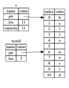

# Slice

slice 允许你引用集合中一段连续的元素序列，而不用引用整个集合。slice 是一种引用，所以它没有所有权。

这里有一个编程小习题：编写一个函数，该函数接收一个用空格分隔单词的字符串，并返回在该字符串中找到的第一个单词。如果函数在该字符串中并未找到空格，则整个字符串就是一个单词，所以应该返回整个字符串。


```rust
fn first_word(s: &String) -> ?
```

`first_word` 函数有一个参数 `&String`。因为我们不需要所有权，所以这没有问题。不过应该返回什么呢？我们并没有一个真正获取 **部分** 字符串的办法。不过，我们可以返回单词结尾的索引，结尾由一个空格表示。

```rust
fn first_word(s: &String) -> usize {
    let bytes = s.as_bytes();

    for (i, &item) in bytes.iter().enumerate() {
        if item == b' ' {
            return i;
        }
    }

    s.len()
}
```

因为需要逐个元素的检查 `String` 中的值是否为空格，需要用 `as_bytes()` 方法将 String 转化为字节数组。

```rust
let bytes = s.as_bytes();
```

接下来，使用 `iter()` 方法在字节数组上创建一个迭代器：

```rust
for (i, &item) in bytes.iter().enumerate() { ... }
```

`iter()` 方法返回集合中的每一个元素，而 `enumerate()` 包装了 iter 的结果，将这些元素作为元组的一部分来返回。enumerate 返回的元组中，第一个元素是索引，第二个元素是集合中元素的引用。这比我们自己计算索引要方便一些。

因为 `enumerate` 方法返回一个元组，我们可以使用模式来解构，所以在 `for` 循环中，我们指定了一个模式，其中元组中的 `i` 是索引而元组中的 `&item` 是单个字节。因为我们从 `.iter().enumerate()` 中获取了集合元素的引用，所以模式中使用了 `&`。

在 `for` 循环中，我们通过字节的字面值语法来寻找代表空格的字节。如果找到了一个空格，返回它的位置。否则，使用 `s.len()` 返回字符串的长度。

现在有了一个找到字符串中第一个单词结尾索引的方法，不过这有一个问题。我们返回了一个独立的 `usize`，不过它只在 `&String` 的上下文中才是一个有意义的数字。换句话说，因为它是一个与 String 相分离的值，无法保证将来它仍然有效。

思考下面使用 `first_word()` 的例子:

```rust
fn main() {
    let mut s = String::from("hello world");

    let word = first_word(&s); // word 的值为 5

    s.clear(); // 这清空了字符串，使其等于 ""

    // word 在此处的值仍然是 5，
    // 但是没有更多的字符串让我们可以有效地应用数值 5。word 的值现在完全无意义！
}
```

这个程序编译时没有任何错误，而且在调用 `s.clear()` 之后使用 `word` 也不会出错。因为 word 与 s 状态完全没有联系，所以 word 仍然包含值 5。可以尝试用值 5 来提取变量 s 的第一个单词，不过这是有 bug 的，因为在我们将 5 保存到 word 之后 s 的内容已经改变。

我们不得不时刻担心 word 的索引与 s 中的数据不再同步，这很啰嗦且易出错！如果编写这么一个 second_word 函数的话，管理索引这件事将更加容易出问题。

现在我们要跟踪一个开始索引 和 一个结尾索引，同时有了更多从数据的某个特定状态计算而来的值，但都完全没有与这个状态相关联。现在有三个飘忽不定的不相关变量需要保持同步。

幸运的是，Rust 为这个问题提供了一个解决方法：字符串 `slice`。

## 字符串 slice

**字符串 slice**（_string slice_）是 `String` 中一部分值的引用，它看起来像这样：

```rust
let s = String::from("hello world");

let hello = &s[0..5];
let world = &s[6..11];
```

不同于整个 String 的引用，hello 是一个部分 String 的引用，由一个额外的 `[0..5]` 部分指定。可以使用一个由中括号中的 `[{starting_index}..{ending_index}]` 指定的 range 创建一个 slice，其中 starting_index 是 slice 的第一个位置，ending_index 则是 slice 最后一个位置的后一个值。就是我们常说的 `左闭右开` 原则;

在其内部，slice 的数据结构存储了 slice 的开始位置和长度，长度对应于 ending_index 减去 starting_index 的值。所以对于 let world = &s[6..11]; 的情况，world 将是一个包含指向 s 索引 6 的指针和长度值 5 的 slice。



对于 Rust 的 `..` range 语法，如果想要从索引 0 开始，可以不写两个点号之前的值。换句话说，如下两个语句是相同的：

```rust
let s = String::from("hello");

let slice = &s[0..2];
let slice = &s[..2];
```

依此类推，如果 slice 包含 `String` 的最后一个字节，也可以舍弃尾部的数字。这意味着如下也是相同的：

```rust
let s = String::from("hello");

let len = s.len();

let slice = &s[3..len];
let slice = &s[3..];
```

也可以同时舍弃这两个值来获取整个字符串的 slice。所以如下亦是相同的：

```rust
let s = String::from("hello");

let len = s.len();

let slice = &s[0..len];
let slice = &s[..];
 ```

在记住所有这些知识后，让我们重写 `first_word` 来返回一个 slice。“字符串 slice” 的类型声明写作 `&str`：

```rust
fn first_word(s: &String) -> &str { ... }
```

通过寻找第一个出现的空格。当找到一个空格，我们返回一个字符串 slice，它使用字符串的开始和空格的索引作为开始和结束的索引。

```rust
fn first_word(s: &String) -> &str {
    let bytes = s.as_bytes();

    for (i, &item) in bytes.iter().enumerate() {
        if item == b' ' {
            return &s[0..i];
        }
    }

    &s[..]
}
```

现在当调用 `first_word` 时，会返回与底层数据关联的引用值。这个值由一个 slice 开始位置的引用和 slice 中元素的数量组成。

现在我们有了一个不易混淆且直观的 API 了，因为编译器会确保指向 String 的引用持续有效。当我们获取第一个单词结尾的索引后，接着就清除了字符串导致索引就无效的 bug 吗？那些代码在逻辑上是不正确的，但却没有显示任何直接的错误。问题会在之后尝试对空字符串使用第一个单词的索引时出现。slice 就不可能出现这种 bug 并让我们更早的知道出问题了。使用 slice 版本的 first_word 会抛出一个编译时错误：

```rust
fn main() {
    let mut s = String::from("hello world");

    let word = first_word(&s);

    s.clear(); // 错误！

    println!("the first word is: {}", word);
}
```

编译错误：

```
$ cargo run
   Compiling ownership v0.1.0 (file:///projects/ownership)
error[E0502]: cannot borrow `s` as mutable because it is also borrowed as immutable
  --> src/main.rs:18:5
   |
16 |     let word = first_word(&s);
   |                           -- immutable borrow occurs here
17 |
18 |     s.clear(); // error!
   |     ^^^^^^^^^ mutable borrow occurs here
19 |
20 |     println!("the first word is: {word}");
   |                                  ------ immutable borrow later used here

For more information about this error, try `rustc --explain E0502`.
error: could not compile `ownership` (bin "ownership") due to 1 previous error
```

回忆一下借用规则，当拥有某值的不可变引用时，就不能再获取一个可变引用。因为 `clear` 需要清空 String，它尝试获取一个可变引用。在调用 clear 之后的 `println!` 使用了 `word` 中的引用，所以这个不可变的引用在此时必须仍然有效。Rust 不允许 clear 中的可变引用和 word 中的不可变引用同时存在，因此编译失败。

**字符串字面值就是 slice**

还记得我们讲到过字符串字面值被储存在二进制文件中吗？现在知道 `slice` 了，我们就可以正确地理解字符串字面值了：

```rust
let s = "Hello, world!";
```

这里 `s` 的类型是 `&str`：它是一个指向二进制程序特定位置的 slice。这也就是为什么字符串字面值是不可变的；`&str` 是一个不可变引用。

**字符串 slcie 作为参数**

在知道了能够获取字面值和 String 的 slice 后，我们对 first_word 做了改进，这是它的签名：

```rust
fn first_word(s: &String) -> &str { ... }
```

而更有经验的 Rustacean 会编写出使它得可以对 &String 值和 &str 值使用相同更具兼容性的函数：

```rust
fn first_word(s: &str) -> &str { ... }
```

如果有一个字符串 slice，可以直接传递它。如果有一个 String，则可以传递整个 String 的 slice 或对 String 的引用。这种灵活性利用了 deref coercions 的优势。定义一个获取字符串 slice 而不是 String 引用的函数使得我们的 API 更加通用并且不会丢失任何功能：

```rust

fn main() {
    // String
    let sentence = String::from("hello world");

    let word = first_word(&sentence[..]);

    println!("the first word is: {}", word);

    // 字面值（str)
    let sentence = "hello world";

    let word = first_word(&sentence);

    println!("the first word is: {}", word);
}
```

## 其他类型 slice

字符串 slice，正如你想象的那样，是针对字符串的。不过也有更通用的 slice 类型。

```rust
let a = [1, 2, 3, 4, 5];
```

就跟我们想要获取字符串的一部分那样，我们也会想要引用数组的一部分。我们可以这样做：

```rust
let a = [1, 2, 3, 4, 5];

let slice = &a[1..3];

assert_eq!(slice, &[2, 3]);
```

这个 slice 的类型是 &[i32]。它跟字符串 slice 的工作方式一样，通过存储第一个集合元素的引用和一个集合总长度。你可以对其他所有集合使用这类 slice。

